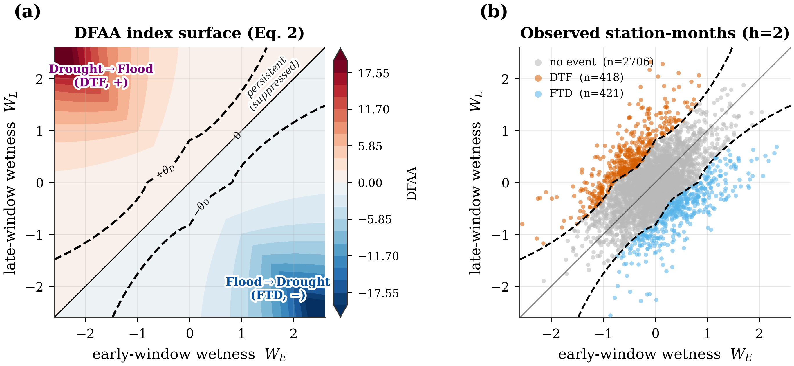
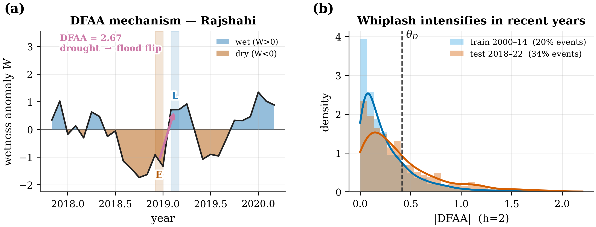
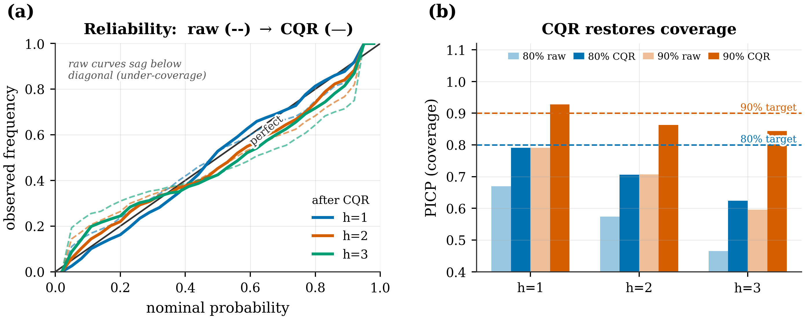
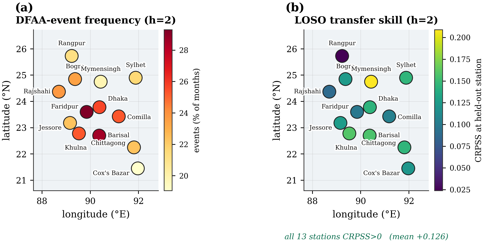

# Calibrated Probabilistic Early Warning of Drought–Flood Abrupt Alternation over Bangladesh

**Bishwadip Maitra · Bangladesh University of Engineering and Technology (BUET)**
Target venue: **IEEE InGARSS 2026** (Hyderabad, 01–04 Dec 2026) — Natural Hazards / Disaster Management track.


> **Status: research in progress.** The pipeline (S1–S6 below) is complete and every number in this README
> is copied verbatim from [`RESULTS_LOG.md`](RESULTS_LOG.md). The manuscript in [`paper/main.tex`](paper/main.tex)
> is a working draft — it still has a few explicit `\todo{}` placeholders (station-map figure, EO product
> provenance per column, author contact) that are deliberately left unfilled rather than guessed at, per this
> repo's no-unsupported-claims rule. See [Status & Roadmap](#status--roadmap).

---

## The problem

A Bangladeshi monsoon can swing a district from drought to flood — or back — within a single season, and
the swing itself is usually more damaging than either extreme alone: parched soil seals over, the next
heavy spell runs off instead of soaking in, and the system has neither storage for the flood nor moisture
for the dry spell that may follow. This is **drought–flood abrupt alternation (DFAA)**, a compound-event
phenomenon well studied over the Yangtze basin in China but, until this project, never studied for
Bangladesh. Existing Bangladesh drought-ML work forecasts a single hazard as a point value with no stated
confidence. This project instead forecasts the **full predictive distribution** of a DFAA index, one to
three months ahead, from a purely satellite/reanalysis-derived record, and **calibrates** that distribution
with conformal prediction so a stated 90% interval actually covers the outcome 90% of the time.

<p align="center">
  
</p>

<p align="center"><em>
(a) The DFAA index (Eq. 2) as a function of early-window and late-window wetness anomaly — positive
(red) marks a drought→flood flip, negative (blue) a flood→drought flip, and persistent same-sign spells
are damped out. (b) The index applied to all 13-station observations: 418 drought-to-flood and 421
flood-to-drought events (h = 2 months) fall cleanly outside the ±θ<sub>D</sub> event bands.
</em></p>

---

## Headline results

All results below are on the **held-out 2018–2022 test period**, with every scaler, climatology,
event threshold, and conformal radius fit **only** on the training years (2000–2014) or the disjoint
calibration years (2015–2017) — never on test. Full run-by-run detail with caveats is in
[`RESULTS_LOG.md`](RESULTS_LOG.md).

1. **Abrupt alternations are intensifying.** With the event threshold fixed on 2000–2014 (20% event rate
   by construction), the 2018–2022 test period shows **~33% of station-months** as DFAA events — a real
   climate signal, and the reason the forecasting problem is hard (the test distribution is heavier-tailed
   than anything the model trained on).
2. **The learned model beats climatology at every lead, and beats a physical baseline at detecting events.**
   Gradient-boosted quantile regression (GBQ) improves CRPS skill over a train-only climatology from **+0.094
   (1 month) to +0.162 (3 months)**, and matches or edges a physically-motivated water-balance bucket model
   at discriminating events (ROC-AUC up to **0.82**) — while also delivering a calibrated full distribution
   the bucket cannot.
3. **Conformal calibration (CQR) restores the coverage the raw model loses.** Raw 90% intervals cover only
   60–79% of test outcomes; conformalized quantile regression lifts that to **84–93%** and roughly halves the
   calibration error (ECE) at every lead. The residual under-coverage at longer leads is itself informative —
   it is a measurement of the same post-2018 non-stationarity, not a bug in the method.
4. **Physics-guided engineered features are neutral — reported honestly, not hidden.** Dropping PET,
   water-balance, antecedent-precipitation, and tendency features shifts CRPS skill by only **+0.001 to
   −0.013** across leads (within noise). Raw anomalies + boosting already capture the moisture signal; the
   headline result does not depend on the physics features.
5. **Skill transfers to unseen stations.** Leave-one-station-out evaluation beats climatology at **all 13
   held-out stations** (mean CRPSS **+0.126**, none negative) — evidence the model generalises rather than
   memorising individual gauges, which matters for a national early-warning service with sparse ground truth.
6. **The forecast has operational decision value.** A cost–loss analysis shows positive value across a wide
   band of user cost/loss ratios (≈0.06–0.7), peaking at **0.37** (drought→flood) and **0.41** (flood→drought)
   at the 2-month lead.

| metric / method                | lead h=1 | lead h=2 | lead h=3 |
|---------------------------------|:---:|:---:|:---:|
| CRPSS, water-balance bucket      | −0.287 | −0.130 | +0.072 |
| CRPSS, QR-LSTM                   | +0.002 | +0.056 | +0.109 |
| **CRPSS, GBQ (best)**            | **+0.094** | **+0.122** | **+0.162** |
| DTF event ROC-AUC, GBQ            | 0.670 | 0.745 | 0.819 |
| FTD event ROC-AUC, GBQ            | 0.780 | 0.769 | 0.746 |
| PICP@90%, GBQ raw → after CQR     | 0.791 → **0.928** | 0.707 → **0.863** | 0.596 → **0.844** |
| ECE, GBQ raw → after CQR          | .036 → .024 | .072 → .040 | .106 → .063 |

*(CRPSS = CRPS skill score relative to climatology, higher is better; DTF/FTD = drought→flood /
flood→drought; PICP = prediction-interval coverage probability; ECE = expected calibration error.
Source: `RESULTS_LOG.md` runs S3–S5.)*

### More figures

<table>
<tr>
<td width="50%">

<p align="center"><em>(a) A representative drought→flood reversal at Rajshahi. (b) The DFAA distribution
is heavier-tailed in the 2018–2022 test years than in 2000–2014 training years — the event rate climbs
from 20% to 33% against a threshold fixed on the training period.</em></p>
</td>
<td width="50%">

<p align="center"><em>(a) Raw forecasts (dashed) sag below the diagonal — overconfident; conformal
calibration (solid) pulls them onto it. (b) Nominal 80%/90% intervals recover most of their lost coverage
after CQR at every lead.</em></p>
</td>
</tr>
</table>

<p align="center">
  
</p>
<p align="center"><em>
(a) DFAA event frequency by station — highest in the central/southern stations (Faridpur, Barisal, Dhaka),
lowest at Cox's Bazar and in the north, contrary to an a-priori expectation of a northeastern-haor
hotspot. (b) Leave-one-station-out transfer skill: every one of the 13 stations beats climatology when
held out entirely from training.
</em></p>

Two additional figures (`fig3_skill_leadtime`, `fig5_drivers_costloss`) are generated by the pipeline but
currently disabled in the manuscript body to meet the 5-page IEEE limit; their content is covered in the
paper's prose and in `RESULTS_LOG.md`. All figures are regenerated by
[`.build/make_paper_figs.py`](.build/make_paper_figs.py) / [`notebooks/make_paper_figs.ipynb`](notebooks/make_paper_figs.ipynb)
and are exported as matching PNG (web/preview), PDF (vector, for LaTeX), and TIFF (print) triplets in
[`paper/figs/`](paper/figs/).

---

## Method, in brief

**Data.** 13 Bangladesh Meteorological Department stations, monthly, January 2000 – December 2022
(3,587 clean station-months after dropping one trailing all-NaN row). Every column (rainfall, soil
moisture, SPEI-3, max/min temperature) is a satellite/reanalysis-derived product; see
[Data](#data-not-included-in-this-repo) below for why the raw file isn't in this repo and
[Status & Roadmap](#status--roadmap) for the one open item (per-column EO product/resolution citation).

**1. DFAA index.** Rainfall and soil moisture are standardized against a **train-only** per-(station,
calendar-month) climatology; combined equal-weight with SPEI into a wetness anomaly `W`. The index adapts
Wu & Li's (2006) long-cycle alternation index to a monthly, multivariate form:

```
DFAA(s,t) = (W_L − W_E) · (|W_E| + |W_L|) · α^(−|W_E + W_L|),   α = 1.8
```

where `W_E` is mean wetness over the h months up to the forecast origin (known) and `W_L` is mean wetness
over the h months after (the target). The first factor signs the swing (drought→flood positive,
flood→drought negative); the second requires both windows to be genuinely anomalous; the third damps
persistent same-sign spells. Events are labelled where `|DFAA|` exceeds its 80th-percentile threshold,
fit on the training years only.

**2. Physics-guided features + a physical baseline (not a PINN).** Potential evapotranspiration
(Hargreaves–Samani), climatic water balance, antecedent precipitation index, soil-moisture/SPEI
tendencies, and rolling sums are added as **input features only** — there is no physics term in any loss.
A parameter-light single-bucket water-balance model, rolled forward on climatological forcing, is the
physical baseline the learned model has to beat.

**3. Predictive distribution.** Two learners — gradient-boosted quantile regression (GBQ) and a compact
QR-LSTM — predict a full quantile grid via a **monotone, non-crossing quantile head** (cumulative sum of
softplus increments; Cannon 2018), trained with the pinball loss.

**4. Calibration.** Split-conformal quantile regression (CQR; Romano et al. 2019) on a calibration block
strictly between the training and test years widens each predicted interval by exactly the empirical
miscoverage observed on calibration data, giving a distribution-free coverage guarantee.

**5. Evaluation.** CRPS / CRPS skill score vs. climatology, PICP & expected calibration error, ROC-AUC for
drought→flood and flood→drought event detection, leave-one-station-out transfer, permutation feature
importance, and a cost–loss decision-value analysis — all with time-ordered splits (never shuffled;
the record is autocorrelated).

Full equations, notation, and the six-step execution plan are in
[`EXPERIMENT_DESIGN.md`](EXPERIMENT_DESIGN.md); every claim above traces to a specific run in
[`RESULTS_LOG.md`](RESULTS_LOG.md); the literature it builds on is in
[`LITERATURE_REVIEW.md`](LITERATURE_REVIEW.md), with every DOI verified against Crossref.

---

## Repository structure

```
Bangladesh Flood/
├── README.md                    # this file
├── CLAUDE.md                    # project governance / working agreement (source of the rules above)
├── EXPERIMENT_DESIGN.md         # architecture, equations, plans (approved before any run)
├── RESULTS_LOG.md               # append-only source of truth for every metric — the paper reads only from here
├── LITERATURE_REVIEW.md         # cited, DOI-verified literature review
│
├── notebooks/                   # shipped deliverables — run top-to-bottom on Colab or locally
│   ├── 01_explore_clean.ipynb
│   ├── 02_build_dfaa_index.ipynb
│   ├── 03_features_baselines.ipynb
│   ├── 04_quantile_models.ipynb
│   ├── 05_conformal_calibration.ipynb
│   ├── 06_interpret_eval.ipynb
│   └── make_paper_figs.ipynb
│
├── .build/                      # plain-.py prototypes the notebooks above are assembled from (smoke-tested first)
│
├── paper/
│   ├── main.tex                 # IEEE InGARSS 5-page manuscript (build: cd paper && pdflatex main && pdflatex main)
│   └── figs/                    # publication-grade figures — PNG + PDF + TIFF per figure
│
├── docs/                        # dated per-step write-ups (not tracked — see .gitignore; mirrored in RESULTS_LOG.md)
├── artefacts/                   # index defs, scalers, thresholds, metrics JSON, model preds (not tracked — regenerate via notebooks)
└── Bangladesh Meterological data.csv   # raw data (not tracked — see Data section below)
```

### What's tracked in git vs. regenerated locally

Per project convention, this repo tracks **code, docs-of-record, and figures** — not raw data, derived
tensors, or regenerable JSON metrics/reports (see [`.gitignore`](.gitignore)):

| Tracked | Not tracked (regenerate locally) |
|---|---|
| All code: `.build/*.py`, `notebooks/*.ipynb` | `Bangladesh Meterological data.csv` (raw data) |
| `paper/main.tex` + `paper/figs/*.{png,pdf,tiff}` | `artefacts/*.npz`, `artefacts/*.json` (derived tensors, metrics) |
| `RESULTS_LOG.md`, `EXPERIMENT_DESIGN.md`, `LITERATURE_REVIEW.md`, `CLAUDE.md` | `docs/*.md` (dated step reports — content is mirrored into `RESULTS_LOG.md`) |
| `.gitignore`, `README.md` | archives (`*.zip` etc.), Python/LaTeX build cruft |

---

## Data (not included in this repo)

`Bangladesh Meterological data.csv` — 13 BMD stations × monthly records, 2000–2022 (~3,588 rows,
`Station_Name, Station_Code, Year, Month, Max_Temp, Min_Temp, Rainfall_mm, Soil_moisture_mm, SPEI_3`) — is
**not committed to git** (it's excluded via `.gitignore`). To reproduce the pipeline:

1. Obtain the dataset (contact the author, or source directly from the Bangladesh Meteorological Department
   / the underlying satellite/reanalysis products once provenance is finalized — see [Status & Roadmap](#status--roadmap)).
2. Place it at the repo root as `Bangladesh Meterological data.csv` (exact filename, spelling included).
3. Run the notebooks in order (below); each writes its artefacts to `artefacts/`, which is also gitignored
   and fully reproducible from the raw CSV.

The raw file is never edited in place — all cleaning (dropping the one trailing all-NaN row, etc.) happens
in code and writes to new artefacts.

---

## Reproducing the pipeline

Each notebook auto-detects Colab vs. local, guards its `pip install`s, sets seeds, and is self-contained
(*Run All* top-to-bottom):

```
notebooks/01_explore_clean.ipynb        → artefacts/clima.json
notebooks/02_build_dfaa_index.ipynb     → artefacts/dfaa.npz, artefacts/dfaa_meta.json
notebooks/03_features_baselines.ipynb   → artefacts/features.npz, artefacts/baseline_metrics.json
notebooks/04_quantile_models.ipynb      → artefacts/model_metrics.json, artefacts/model_preds.npz
notebooks/05_conformal_calibration.ipynb→ artefacts/conformal_metrics.json
notebooks/06_interpret_eval.ipynb       → artefacts/interpret_metrics.json
notebooks/make_paper_figs.ipynb         → paper/figs/*.{png,pdf,tiff}
```

Each notebook's own `.build/stepNN_*.py` counterpart is the plain-Python prototype it was assembled from
(smoke-tested on real data first); the shipped, reviewable artefact is always the `.ipynb`.

Recorded environment: `Python 3.14.2 · numpy 2.4.0 · pandas 2.3.3 · scipy 1.17.1 · scikit-learn 1.8.0 ·
statsmodels 0.14.6 · torch 2.11.0+cpu`. Full reproducibility notes (seeds, splits, leakage guards) are in
`EXPERIMENT_DESIGN.md` §5 and enforced throughout: **all scalers, thresholds, and conformal radii are fit
on the training/calibration split only**, splits are time-ordered (2000–14 train / 2015–17 calibration /
2018–22 test) plus leave-one-station-out — the record is autocorrelated and is never randomly shuffled.

To build the paper PDF:

```bash
cd paper && pdflatex main && pdflatex main
```

---

## Status & Roadmap

**Done:** data cleaning + train-only climatology (S1), DFAA index + event labels (S2), physics-guided
features + baselines incl. water-balance bucket (S3), GBQ + QR-LSTM quantile models (S4), split-conformal
calibration (S5), interpretation — ablation, drivers, cost–loss, LOSO (S6). All six steps logged in
`RESULTS_LOG.md` with a traceable `run_id` per block.

**Open items before the manuscript is submission-ready** (tracked as explicit `\todo{}` markers in
`paper/main.tex`, intentionally left unfilled rather than guessed at):

- **Confirm and cite the specific EO/reanalysis product and native resolution per variable** (rainfall,
  soil moisture, SPEI, temperature) — required before any provenance claim is finalized (governance Rule 3).
- Insert the study-area station map and the GIS spatial-map figure panels into the manuscript.
- Confirm author department/contact details and funding/data-source acknowledgements.
- Verify the official InGARSS 2026 page/format limit against the author kit once published.
- Residual under-coverage at 2–3 month leads under the 2018–2022 non-stationarity motivates **adaptive
  / rolling conformal recalibration** (e.g. EnbPI) as the natural next experiment, not yet run.

---

## Citing this work

The manuscript is in preparation for IEEE InGARSS 2026 and not yet published — please contact the author
before citing. A formal citation (with DOI) will be added here once the paper is accepted.

---

## Acknowledgements

Bangladesh Meteorological Department for the underlying station record, and Bangladesh University of
Engineering and Technology (BUET) for support. Full literature this project builds on — with every DOI
verified — is in [`LITERATURE_REVIEW.md`](LITERATURE_REVIEW.md).
